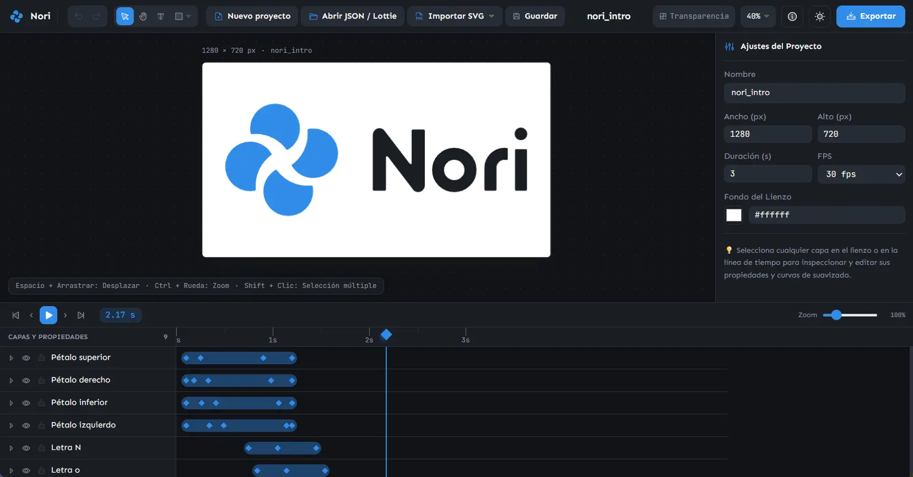

Nori es el lugar donde las ideas cobran movimiento.

Es un estudio de animación vectorial y motion design que funciona por completo en el navegador. No depende de servidores externos ni de suscripciones para existir. Es una herramienta construida sobre una idea simple: **las animaciones y los archivos pertenecen a quienes los crean**.

Pero Nori también nace con otra convicción: **animar no debería requerir una suite gigantesca**.

En un mundo donde las herramientas de motion design suelen ser pesadas, costosas y difíciles de aprender, Nori busca hacer pocas cosas, pero hacerlas bien. Capas, fotogramas clave y curvas de suavizado. Sin complejidad innecesaria, sin configuraciones interminables y sin perder el foco.



## Principios de Nori
- Offline first.
- Las animaciones y los archivos pertenecen a quienes los crean.
- No depende de servidores externos ni de suscripciones para existir.
- La simplicidad es una característica, no una limitación.
- Los proyectos se guardan en formatos abiertos y legibles por humanos (JSON, Lottie, SVG).
- Evitar dependencias propietarias.
- Lo que se crea en Nori debe poder abrirse y reutilizarse con herramientas externas.
- Cada nueva funcionalidad debe justificar su existencia.

## Lo que Nori puede hacer

- **Lienzo vectorial** con zoom, desplazamiento, punto de anclaje y vista previa de transparencia.
- **Capas de formas y texto**: rectángulos, cápsulas, círculos, estrellas y textos editables.
- **Grupos de capas** que se animan como un todo mientras cada capa conserva su propia animación.
- **Operaciones booleanas** (unir, restar, intersectar y excluir) entre formas que siguen siendo editables y animables, como en Figma.
- **Línea de tiempo con fotogramas clave** por propiedad, arrastrables y con reproducción en bucle.
- **Curvas de suavizado** spring, Bézier, ease-in-out, bounce y lineal, con vista previa en vivo.
- **Importación de animaciones Lottie** y de proyectos propios, desde un botón o arrastrando el archivo.
- **Exportación a GIF, MP4, WebM, SVG animado, Lottie (normal u optimizado) y JSON**, con resolución, FPS, antialiasing y fondo transparente configurables.
- **Carpeta local**: el espacio de trabajo puede guardarse en una carpeta de tu equipo, con un JSON por proyecto y una carpeta por cada carpeta de Inicio (Chrome, Edge, Brave u Opera de escritorio).
- **Deshacer y rehacer** con los atajos de siempre.
- **Interfaz en español e inglés**, tema claro y oscuro, e instalación como aplicación (PWA).

## Lo que Nori no pretende ser

Nori no busca convertirse en:

- Un reemplazo de las grandes suites de postproducción.
- Una plataforma llena de paneles que nunca usarás.
- Una herramienta que requiera horas de aprendizaje antes de animar lo primero.
- Un ecosistema cerrado del que sea difícil sacar tu trabajo.

Su objetivo es ser una herramienta objetiva, funcional y predecible que desaparezca en el fondo para que puedas concentrarte en darle vida a tus ideas.

## Una nota personal

Nori también es un experimento.

Creo que la inteligencia artificial está transformando la forma en que se crea software, permitiendo que personas con perfiles distintos al desarrollo tradicional puedan construir herramientas útiles.

Como diseñador UX, utilizo la IA como un compañero de desarrollo para convertir ideas en productos reales. El resultado no pretende reemplazar las buenas prácticas de ingeniería, sino demostrar una nueva forma de crear.

Nori forma parte de la misma familia que [Kora](https://github.com/lorspi/Kora) y [Tervo](https://github.com/lorspi/Tervo): herramientas que comparten diseño, filosofía y la convicción de que tu trabajo te pertenece.

Si encuentras errores, oportunidades de mejora o tienes sugerencias, las contribuciones son siempre bienvenidas.

## Demostración en vivo
[nori.lorspi.com](https://nori.lorspi.com)

## Comienza a usar Nori

### Requisitos previos
- Node.js

### Instalación
1. Clona el repositorio
```bash
git clone https://github.com/lorspi/Nori.git
cd Nori
```
2. Instala las dependencias con:
```bash
npm install
```
3. Ejecuta el servidor de desarrollo con:
```bash
npm run dev
```
4. Accede a la herramienta en tu servidor local: [localhost:8080](http://localhost:8080/)

### Compilar para producción
```bash
npm run build
```

La aplicación compilada queda en la carpeta `dist/`, lista para servirse como sitio estático.

## Versionado

La versión de Nori vive en `public/version.txt` y se incrusta en la aplicación al compilar. Al publicar una nueva versión:

1. Actualiza `public/version.txt`.
2. Actualiza `CACHE_NAME` en `public/service-worker.js` (ej: `nori-cache-0.1.1`) para que el navegador descarte la caché anterior.
3. Registra los cambios en `CHANGELOG.md`.

## Stack Tecnológico

- React 19
- TypeScript
- Vite
- Tailwind CSS
- Phosphor Icons
- Canvas 2D
- gifenc
- paper.js (operaciones booleanas, se descarga solo cuando un proyecto las usa)

## Licencia
Nori está licenciado bajo la Licencia Apache 2.0. Ver el archivo [LICENSE](./LICENSE) para más detalles.

## Apoya al creador
¿Te gusta mi proyecto? Invítame a un café

<a href="https://ko-fi.com/lorspi" target="_blank">
  
</a>
